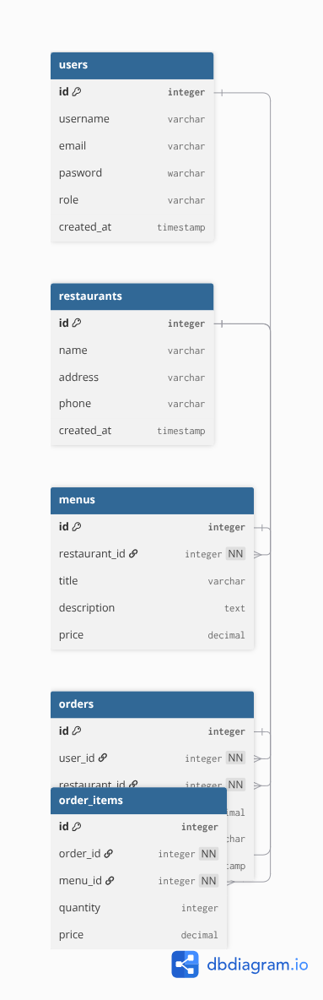

µlhn v,,                                                                                                                                                                                                                                                                                                        # Projet Vite & Gourmand - ECF Studi

Bienvenue sur le depot officiel du projet **Vite & Gourmand**,réalisé dans le cadre de la formation Développeur Full Stack (ECF).

## Description du projet
Vite & Gourmand est une plateforme de commande de repas en ligne mettant en relation des utilisateurs, des restaurants et des gestionnaires de livraison.

## Modélisation de la Base de Données (SQL)
Le schéma relationnel de la base de données a été modélisé sous `dbdiagram.io` et exporté au format image.

* **Script SQL :** [`schema.sql`](./schema.sql)
* **Schéma visuel : **
* 

## Technologies utilisées
* **Base de données relationnelle :** PostgreSQL / MySQL (SQL)
* **Outil de modélisation :** dbdiagram.io
*  **Versionnage :** Git & GitHub

## Base de données NoSQL (MongoDB)

Conformément aux exigences du cahier des charges de l'EFC Studi, une base de données non relationnelle (**MongoDB) est utilisée pour stocker les données flexibles, assurer la traçabilité des actions (logs) et alimenter le tableau de bord administrateur (calcul du chiffre d'affaires et graphiques par menu).

### 1. Structure des collections (JSON)

* **Collection `stats_menus` (Statistiques pour l'espace administrateur) :**
  ```json
  {
    "menu_id":1,
    "titre_menu": "Menu de Noel Traditionnel",
    "total_commandes": 28,
    "chiffre_affaires": 1250.00,
    "periode": "2026-09"
  }

 * **Collection `logs_activite` (Traçabilité des actions employés) :**
   ```json
  {
    "utilisateur_id":2,
    "role": "employee",
    "action": "Modification de statut",
    "details": "Commande #12 passée en préparation"
  }
  ```
  
  
